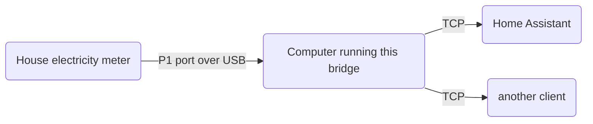

# Smart Meter bridge

Smart Meter bridge is a program to expose data from a serial port to remote clients as a TCP service.

```sh
$ GOOS=linux GOARCH=arm64 CGO_ENABLED=0 go build -o smartmeter-bridge-linux-arm64 .

# forward data from /dev/ttyUSB0 to all clients connecting to TCP port 9988
$ ./smartmeter-bridge-linux-arm64 -serial /dev/ttyUSB0 -tcp 9988
```

This is useful, for example, to relay data from a P1 port of a DSMR smart meter for house utilities (electricity and gas)
to a remote machine on the same network; for example one running [Home Assistant][ha] that aggregates data related to energy usage.



The code in this repo is inspired by https://github.com/legolasbo/smartmeterBridge, but has been rewritten from the
ground up to have no depedencies, no YAML configuration, better signal and error handling, and context cancellation.

This has only been tested with DSMR v5.

## Why not [ser2net](https://ser2net.sourceforge.net/)?

Ser2net offers a lot more features than are needed in this particular use-case. Smart Meter Bridge is written in Go 
which allows it to be compiled to a single executable file that can run without dependencies.


  [ha]: https://www.home-assistant.io/integrations/dsmr/